

  

<h1 align = "center">🌟u-blox AssistNow Usage Guide🌟</h1>

### [中文](./assistNow_CN.md)

### Available devices

| Devices              |     |
| -------------------- | --- |
| [T-Deck Plus][1]     | ✅   |
| [T-Deck Pro][2]      | ✅   |
| [T-LoRa-Pager][3]    | ✅   |
| [T-Watch-S3-Plus][4] | ✅   |
| [T-Watch-Ultra][5]   | ✅   |
| [T-Beam-Supreme][6]  | ✅   |

[1]: https://lilygo.cc/products/t-deck-plus-1
[2]: https://lilygo.cc/products/t-deck-pro
[3]: https://lilygo.cc/products/t-lora-pager
[4]: https://lilygo.cc/products/t-watch-s3-plus
[5]: https://lilygo.cc/products
[6]: https://lilygo.cc/products/t-beam-supreme

> \[!IMPORTANT]
> * This document is only for devices using the **u-blox M10 series**, other devices cannot use the document
> * The devices listed above can all use this method to write ephemeris data. Devices not listed do not support

### Step1: Flash the GPS loopback firmware to the device. If it is a device in LilyGoLib, in the factory firmware, in the GPS interface, switch the **NMEA to Serial** switch to Enabled

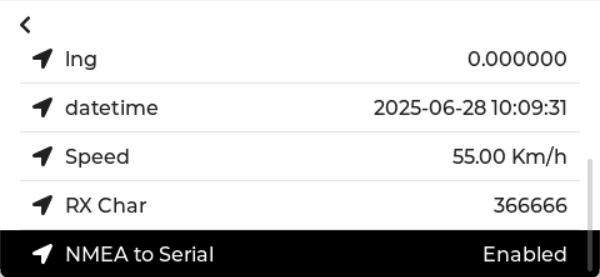

## Step2: Register a Thingstream account

1. Log in to [u-blox Thingstream](https://portal.thingstream.io/) to register an account

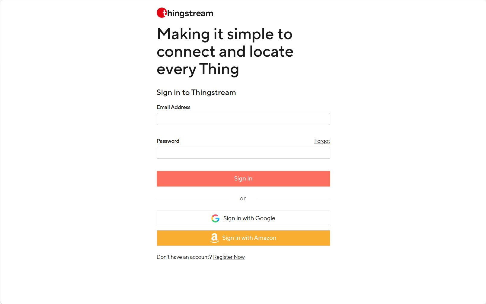

2. Apply for AssistNow Token

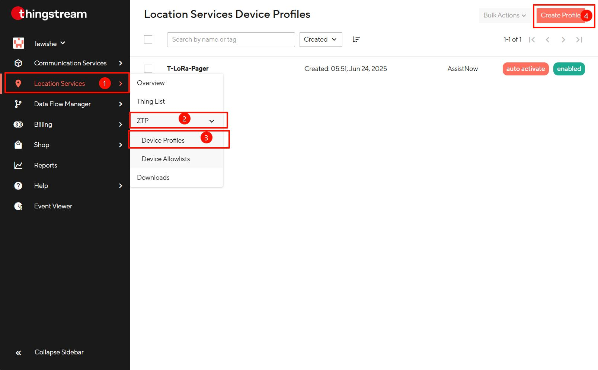

3. Create a Profile

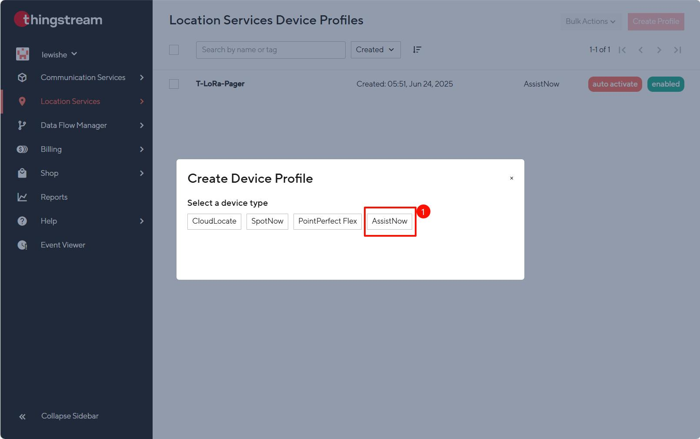

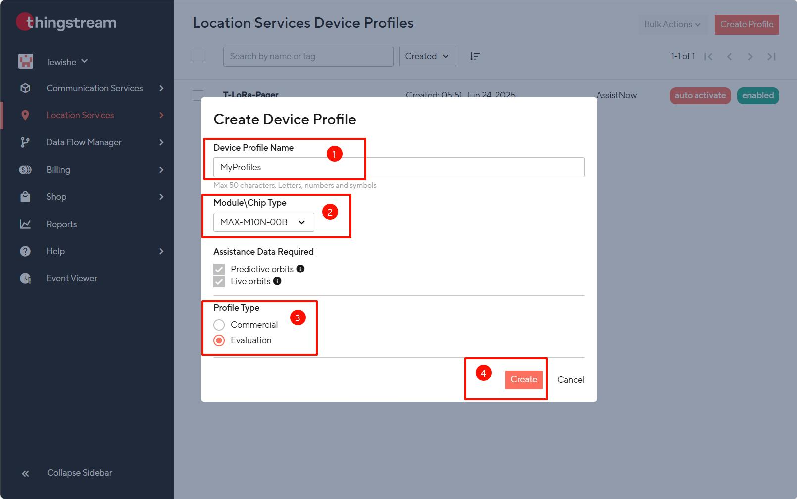

4. Check the Token, which will be used in the following steps

## Step3: Use u-cetnter2 to send ephemeris data to the device

1. Download [u-center2 >= V25.06.18](https://www.u-blox.com/en/product/u-center)

2. Register a u-center2 account and log in

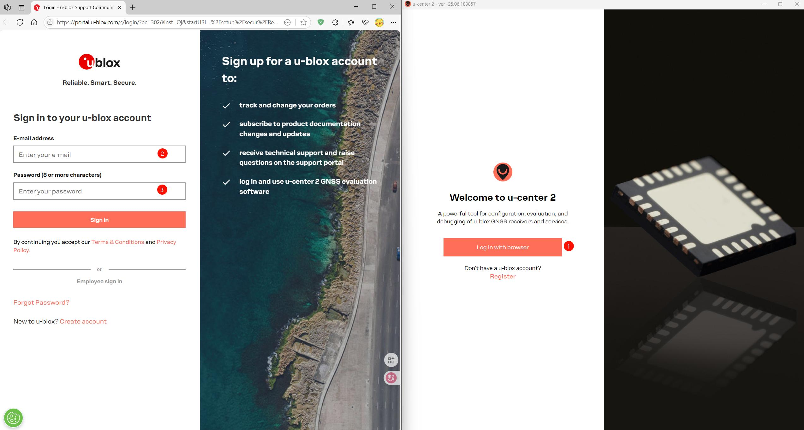

3. Select the port and baud rate of the device

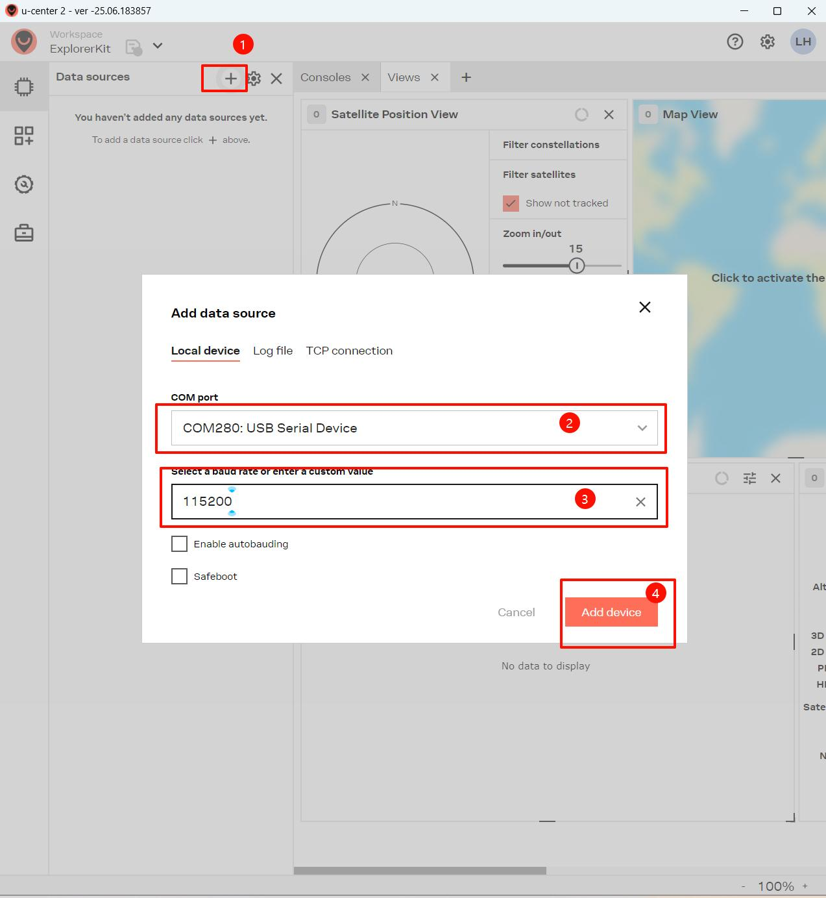

4. Check whether the GPS information is detected normally

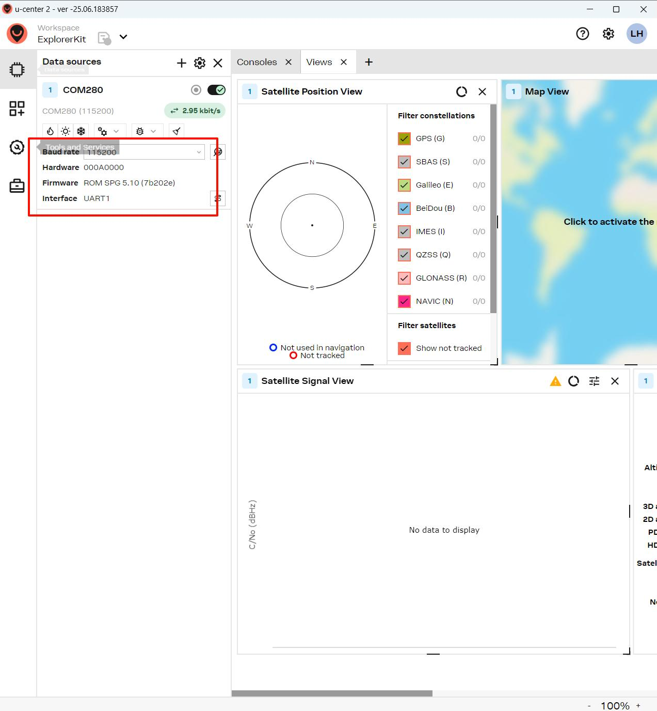

5. Use AssistNow at the position shown below and fill in the AssistNow token applied in Thingstream

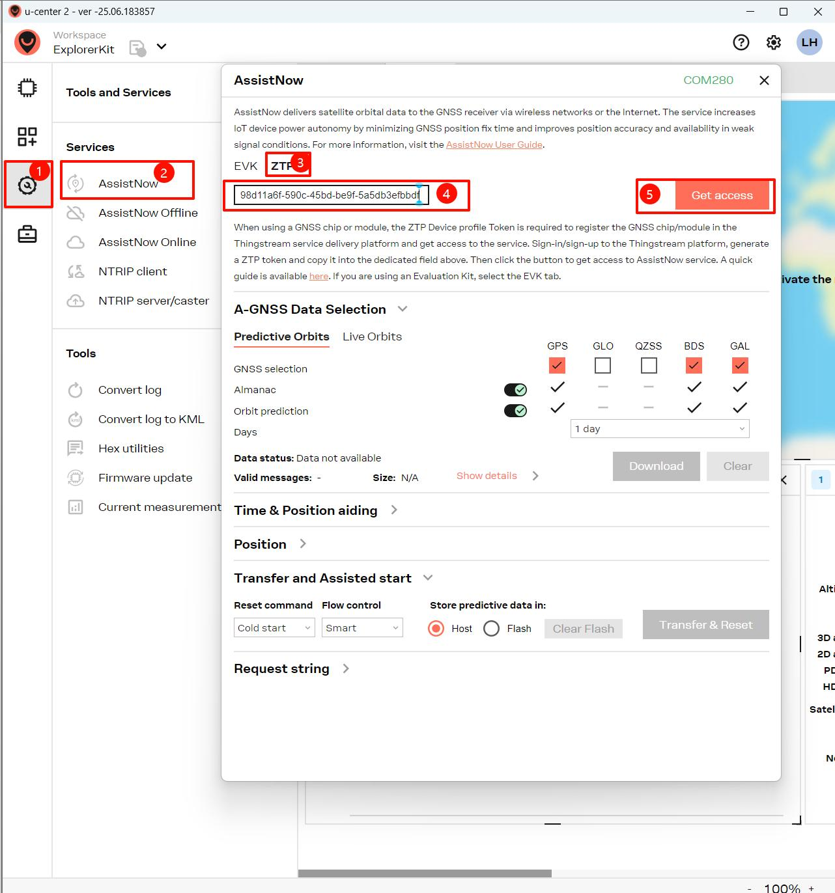

6. If the token is correct, the icon will turn green

7. Click Download to download GPS ephemeris data. Please keep the default settings. The maximum number of days is one day

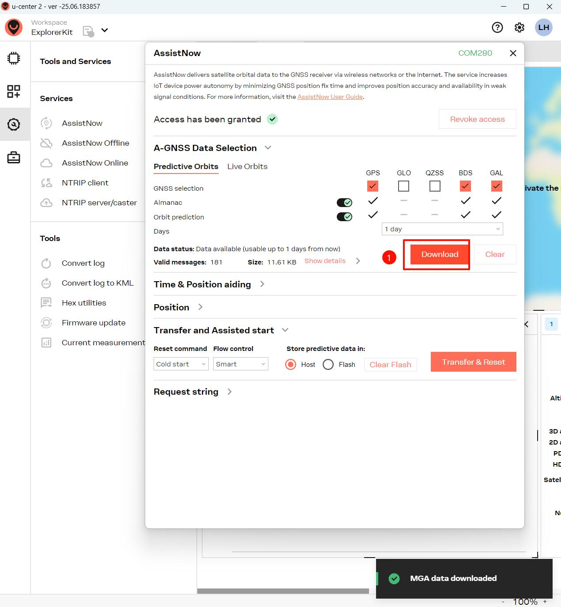

8. Click the Transfer button to send the ephemeris to the device

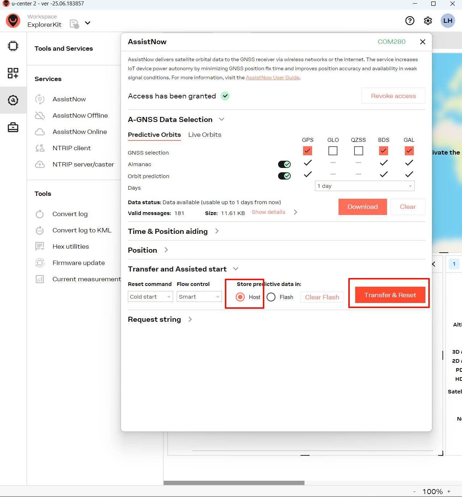

9. Wait for the transfer to complete. If the transfer fails, please try a few more times

10. The following figure shows the prompt of successful transmission

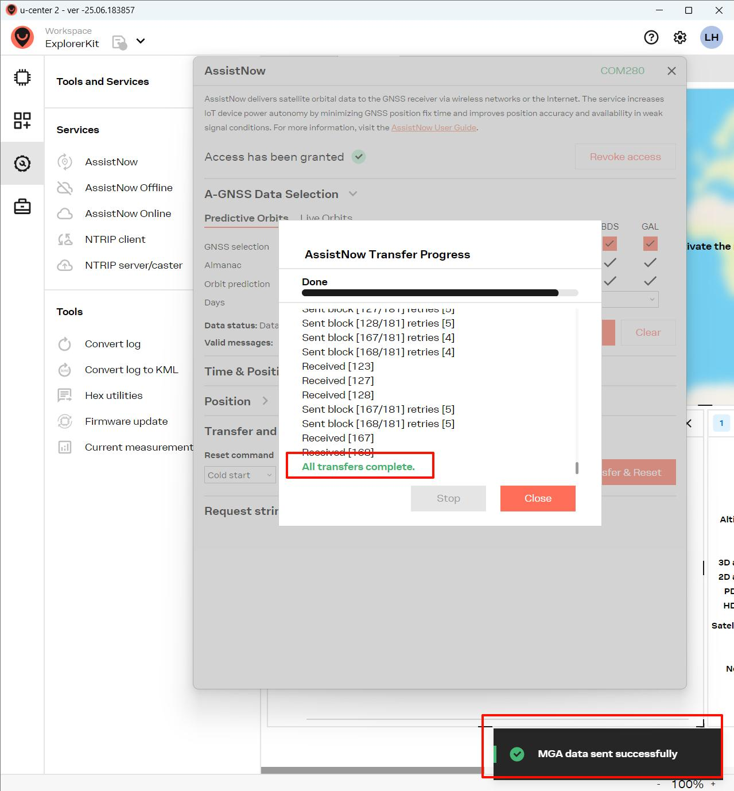

## Step4: Test the actual effect

1. Switch the **NMEA to Serial** switch to Disable, place the device outdoors, and with the acceleration of AssistNow, the GPS positioning speed will be greatly improved.
2. If it is other Ublox devices, please flash the factory firmware of other devices
3. Without turning off the GPS device, the GPS ephemeris data will remain valid for one day. If the device is powered off, the GPS ephemeris data will be lost. Please follow the above method to resend the ephemeris data to the device. If the data exceeds the validity period of one day, please update the ephemeris data